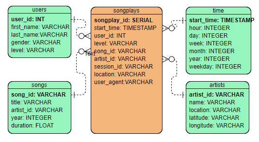

# Sparkify Data Modeling with Postgres

This is the project submission for the Data Engineering Nanodegree. 

The project contains practice for:
1. Designed a Star Schema database
2. Data modeling with SQL(Postgres)
3. ETL process using python

Please check out the [data_modeling_postgres.ipynb](data_modeling_postgres.ipynb) for the final presentation of this project.

## Project Introduction
A startup called Sparkify wants to analyze the data they've been collecting on songs and user activity on their new music streaming app. Currently, they don't have an easy way to query their data, which resides in a directory of JSON logs on user activity on the app, as well as a directory with JSON metadata on the songs in their app. 
As a data engineer, my task is to create a database schema and ETL pipeline for this analysis.

## Project Breakdown
- Understand the datasets
- Design a star schema database
- Write create, drop and SQL statements to create(or reset) database and tables
- Complete the ETL pipeline using Python
- Finally presentation of the project

### Project files

Files used on the project:
1. **data** folder nested at the home of the project, where all JSON reside.
2. **create_tables.py** create or reset the database and tables.
3. **sql_queries.py** contains all SQL queries.
4. **Data Modeling with Postgres.ipynb** final presentation of the project.
5. **etl.ipynb** reads and processes a single file from song_data and log_data and loads the data into your tables. 
6. **etl.py** reads and processes files from song_data and log_data and loads them into your tables. 
7. **README.md** current file, provides a discussion on my project.
8. **Star Schema.PNG** graphic of the Star Schema designed.

## Understanding the Datasets
- **Song datasets**: all json files are nested in subdirectories under */data/song_data*. A sample of this files is:

```
{"num_songs": 1, "artist_id": "ARJIE2Y1187B994AB7", "artist_latitude": null, "artist_longitude": null, "artist_location": "", "artist_name": "Line Renaud", "song_id": "SOUPIRU12A6D4FA1E1", "title": "Der Kleine Dompfaff", "duration": 152.92036, "year": 0}
```

- **Log datasets**: all json files are nested in subdirectories under */data/log_data*. A sample of a single row of each files is:

```
{"artist":"Slipknot","auth":"Logged In","firstName":"Aiden","gender":"M","itemInSession":0,"lastName":"Ramirez","length":192.57424,"level":"paid","location":"New York-Newark-Jersey City, NY-NJ-PA","method":"PUT","page":"NextSong","registration":1540283578796.0,"sessionId":19,"song":"Opium Of The People (Album Version)","status":200,"ts":1541639510796,"userAgent":"\"Mozilla\/5.0 (Windows NT 6.1) AppleWebKit\/537.36 (KHTML, like Gecko) Chrome\/36.0.1985.143 Safari\/537.36\"","userId":"20"}
```

## Designing the Star Schema

The graphic below is the Star Schema designed based on the understanding of the business model and datasets.


## Creating tables and SQLs

1. Write DROP, CREATE and INSERT query statements in [sql_queries.py](sql_queries.py)

2. Run [create_tables.py](create_tables.py) file to create tables.

## ETL Pipeline

1. After database and tables are created, use [etl.ipynb](etl.ipynb) to read and process a single file to help design the ETL process.

2. Use python to create a [etl.py](etl.py) to process all the datasets in the data folder.

## Finally the presentation

Use the file [Data Modeling with Postgres](data_modeling_postgres.ipynb) to review the project and test all the codings.


## Author
**Rick Wu**
