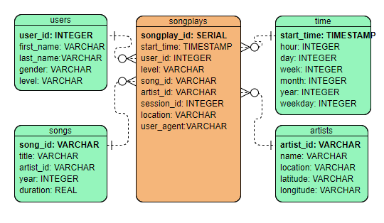

# Data Warehouse and ETL Design

This is the project submission for the Data Warehouse and ETL Design. 

The project contains practice for:
1. Designed a data warehouse in Redshift.
2. Wrote query statements including DROP, CREATE, COPY, INSERT, and SELECT.
3. Built an ETL pipeline to load data from S3 to staging tables on Redshift and execute SQL statements that create the analytics tables from these staging tables.
4. Exploratory data analysis and visualization using Python.

Please check out this [Jupyter notebook](data_warehouse_and_analysis.ipynb) for data analysis based on the data warehouse.

## Project Introduction
A music streaming startup, Sparkify, has grown its user base and song database and want to move their processes and data onto the cloud. Their data resides in S3, in a directory of JSON logs on user activity on the app, as well as a directory with JSON metadata on the songs in their app.
As a data engineer, my task is to build an ETL pipeline that extracts their data from S3, stages them in Redshift, and transforms data into a set of dimensional tables for their analytics team to continue finding insights in what songs their users are listening to. 

## Project Breakdown
- Understand the datasets
- Design a data warehouse
- Write create, drop and SQL statements to create(or reset) database and tables
- Build an ETL pipeline using Python
- Data analysis

### Project files

Files used on the project:
1. **create_tables.py** is where we create fact and dimension tables for the star schema in Redshift.
2. **data_warehouse_and_analysis.ipynb** is the final presentation of the project.
3. **dwh.cfg** is the configuration file.
4. **etl.py** is where we load data from S3 into staging tables on Redshift and then process that data into the analytics tables on Redshift. 
5. **README.md** current file provides a discussion on my project.
6. **redshift_data_warehouse.PNG** graphic of the data warehouse designed.
7. **sql_queries.py** is where we define all SQL statements.


## Understanding the Datasets
- **Song datasets**: all json files are nested in subdirectories under *s3://udacity-dend/song_data*. A sample of this files is:

```
{"num_songs": 1, "artist_id": "ARJIE2Y1187B994AB7", "artist_latitude": null, "artist_longitude": null, "artist_location": "", "artist_name": "Line Renaud", "song_id": "SOUPIRU12A6D4FA1E1", "title": "Der Kleine Dompfaff", "duration": 152.92036, "year": 0}
```

- **Log datasets**: all json files are nested in subdirectories under *s3://udacity-dend/log_data*. A sample of a single row of each files is:

```
{"artist":"Slipknot","auth":"Logged In","firstName":"Aiden","gender":"M","itemInSession":0,"lastName":"Ramirez","length":192.57424,"level":"paid","location":"New York-Newark-Jersey City, NY-NJ-PA","method":"PUT","page":"NextSong","registration":1540283578796.0,"sessionId":19,"song":"Opium Of The People (Album Version)","status":200,"ts":1541639510796,"userAgent":"\"Mozilla\/5.0 (Windows NT 6.1) AppleWebKit\/537.36 (KHTML, like Gecko) Chrome\/36.0.1985.143 Safari\/537.36\"","userId":"20"}
```

## Designing the data warehouse

The graphic below is the data warehouse designed based on the understanding of the business model and datasets.


## Creating tables and SQLs

1. Write DROP, CREATE, COPY and INSERT query statements in [sql_queries.py](sql_queries.py)

2. Launch a redshift cluster and create an IAM role that has read access to S3.

3. Add redshift database and IAM role info to [dwh.cfg](dwh.cfg)

3. Run [create_tables.py](create_tables.py) file to create tables. If the tables already exist, the DROP statements will drop the tables first.

## ETL Pipeline

After tables are created in the data warehouse, use [etl.py](etl.py) to load data from S3 to staging tables on Redshift, and then load data from staging tables to analytics tables on Redshift.

<font color="red"> Make sure to delete the redshift cluster when finished to prevent huge cost.</font>

## Data Analysis

Use the file [data_warehouse_and_analysis](data_warehouse_and_analysis.ipynb) to review the project and analytic queries.


## Author
**Rick Wu**
