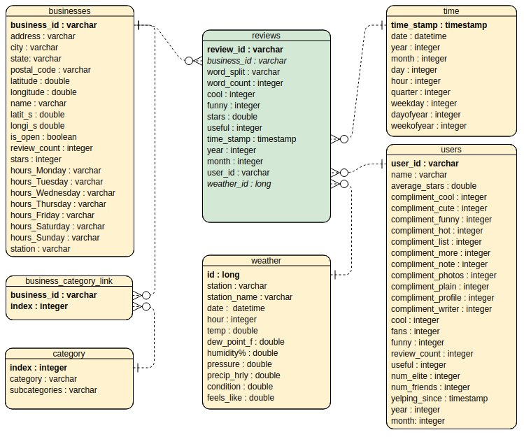

# Yelp big data challenge

## Introduction

Yelp was founded in 2004. The company develops, hosts, and markets the Yelp.com website and the Yelp mobile app, which publish crowd-sourced reviews about businesses. As of fourth quarter, 2019, Yelp had [205 million](https://www.yelp-press.com/company/fast-facts/default.aspx) reviews on its site. All these reveiws written by yelpers provide in-depth insights on local businesses of every sort.

Yelp has been using AWS s3 to store their daily photos and logs files [since 2013](https://techcrunch.com/2018/06/04/how-yelp-mostly-shut-down-its-own-data-centers-and-moved-to-aws/) and use AWS EMR(Amazon Elastic MapReduce) to process the log data to help answer business questions.

In this project, I will use the same tools yelp is using to perform **data gathering from multiple source to s3, data processing using AWS EMR, and desiging data model** to allow their analytics to continue finding business insights and build product to help local businesses.


## Project Breakdown

The project follows steps below:
1. Project scope and data gathering
2. Data exporlation and assessment
3. Data model design
4. Building ETL pipline to process the data
5. Deployment
6. Summary


## Project scope and data gathering

### Project scope

The goal of the project is to build a dimentional data model(analytics tables) using [Yelp Open Dataset](https://www.yelp.com/dataset/), and store them to s3 as parquet format. Data analyst, data scientist, business analyst, and software engineer will be able to analyze the data and create visualization to answer business questions, build recommendation systems or prediction models, and develop new products based on the data model. I included a [notebook yelp_eda](jupyter%20notebook/yelp_eda.ipynb) based on the data model I designed to show you how I used query to answer some business questinos.


### Data gathering

The project contains data from 3 source.

1. The Yelp Open Dataset: Downloaded from [Kaggle](https://www.kaggle.com/yelp-dataset/yelp-dataset). The Yelp dataset is a subset of Yelp's businesses, reviews, and user data for use in personal, educational, and academic purposes. Available as JSON files. It consists of 6 files, but in our project we will be only using business.json, review.json, and user.json. The documentation of the dataset can be found [here](https://www.yelp.com/dataset/documentation/main).
2. Yelp category data: Downloaded through [Yelp fusion API](https://www.yelp.com/developers/documentation/v3/category) as json files. The yelp open dataset doesn't provide a full list of category for all businesses. We can get the categroy data through their API. This will help us answer questions like: Is a business rated higher or lower than category average, or how many competitos are there in the save area.
3. Histical weather data: Scraped from [wunderground](https://www.wunderground.com/history) as csv files. I noticed that there is location information in the bussiness.json, and we can look up histical weather data to see if there is a relationship among temperature, humidity, wind speed and the revews. 

The [notebook data_preparation](jupyter%20notebook/data_preparation.ipynb) contains the steps to prepare the data. It walks you through the steps to download data from 3 different data source and upload them to AWS s3.

The size of all data files is around 10.5G. The best solution to process the dataset is to use Pyspark and take the advantage of cloud computing(EMR) to process the data at scale.

### Project file structure

The project files are organized as below.
```
project_6_capstone			(project folder)
├── data				(data folder to store dataset locally)
│   ├── weather-data			(historical weather data)
│   ├── yelp-dataset			(all yelp data)
├── src					(folder to hold python scripts)	
│   ├── data_preparation.py		(python file to prepare the dataset)
│   ├── auto_deploy_spark_app.py	(python file to deploy the spark app)
│   └── spark_app			(folder for all etl files related)
│       ├── dl.cfg			(configure file for the etl pipline)
│       ├── setup.sh			(bash file to setup env in EMR)
│       ├── terminate_idle_cluster.sh	(bash file to terminate the EMR)
│       └── etl.py			(pyhon file for the ETL pipline)
├── jupyter notebook			(folder to hold all jupyter notebooks)
│   ├── yelp_eda.ipynb			(exploratory analysis on the data model)
│   ├── data_preparation.ipynb		(steps to prepare the dataset)
│   └── understand_yelp_dataset.ipynb	(raw data exporlation and assessment)
└── resource				(folder to hold resource)
    ├── chromedriver			(chromedriver used for weather scraper)
    ├── project.cfg			(configure file for the project)
    ├── capstone_erd.png		(ERD for the data model)
    └── de_capstone.yml			(conda environment file)
```

## Data exporlation and assessment

The real world dataset is messy. In order to build a reliable data model, first we need to identiy data qulity issues, like missing values, duplicates, wrong data types, etc. Then, we will design steps to process the data and convert the data into analytics tables.

The [notebook understand_yelp_dataset](jupyter%20notebook/understand_yelp_dataset].ipynb) documented the steps to explore the dataset, deal with duplicates, impute missing values, create new features and combine tables using pyspark standalone mode.


## Data model design

We will design a snowflake schema data model, which includes one fact table reviews and six dimention tables. The snowflake data model is efficient to perform queries, simplify business reporting logic and feed OLAP systems. 

The fact table contains all reviews and measures from yelpers, time_stamp generated when the review was logged, and foreign keys of the dimention tables.

The dimention tables contains bussiness and category infomation, user related attributes, time dimention and historical weather data.

The graphic below is the data warehouse designed based on the understanding of the business model and datasets.



## ETL Pipline

The [ETL pipline](src/spark_app/etl.py) to process the dataset contains steps below:

1. Create a spark session
2. Process weather data
  * Import weather data from input folder.
  * Change data type, drop dulicates and rename columns.
  * Run data quality check: Row numbers, missing values and duplicates.
  * Save it as parquet file and partition by station.
3. Process business and category data
  * Import business, category and geo location data from input folder.
  * Rename columns and run  data qulity check for category table.
  * Save the categroy table as parquet file.
  * Create link table between bussiness and category.
  * Save the link table as parquet and partition by state of the business.
  * Generate new features to lookup station from geo location table.
  * Drop columns with too many missing values and change data types.
  * Run data quality check: Row numbers, missing values and duplicates.
  * Save businesses table as parquet file and partition by state.
4. Process user information
  * Import user data from input folder
  * Change data types for columns.
  * Create new features num_elit and num_friends based column elite and friends.
  * Run data quality check: Row numbers, missing values and duplicates.
  * Save users table as parquet file and partition by year and month.
5. Process review data
  * Import review data from input folder.
  * Import business and weather data from output folder.
  * Change data types for time_stamp and create time features.
  * Join bussinesses and weather table to look up sation and weather_id.
  * Generate new features based on column text.
  * Run data quality check: Row numbers, missing values and duplicates.
  * Save reveiws table as parquet file and partition by year and month.

## Deployment

To deploy our ETL pipline we can create a EMR cluster in AWS and sumbit spark job by connecting to EMR master node via SSH. However, I'd like to deploy the ETL piline programmably to cut the manual work.

I wrote a python script [auto_deploy_spark_app](src/auto_deploy_spark_app.py) to deploy the ETL pipline automatically and terminate the EMR cluster when the job is done. We can simply run the auto_deploy_spark_app.py to deploy the ETL pipline and run it on EMR cluster.
The Python file invloves steps below:
1. Create a [boto3](https://pypi.org/project/boto3/) session
2. Open s3 connection
3. Create a tar.gz file for files of the spark app(ETL pipline)
4. Upload [bash files](src/spark_app) and tar.gz file to s3
5. Open an EMR connection
6. Create a custer and run the spark app
7. Print states until the cluster termindates
8. Remove spark app files from s3

## Summary

In this project, we go through the process of data gathering and exploration, data model design, building ETL pipline and deploying spark job to cloud. This big data solution is also can be applied to real world, because the AWS EMR can be scaled automatically based on the size of the data. The only difference is that in the real world, we will have log files saved in s3 and we need to process these log files on a daily basis. To schedule the spark job every day, Airflow(which I used in project 5 data pipline with Airflow) is a good choice to perform the task on a schedule and backfill tasks if needed.

### Scenarios analysis

Let's talk about some real world scenarios that how we would approach the problem differently.

#### The data was increased by 100x.

If the data was increated by 100x or even 1000x, our solution still can handle it because we use s3 to store the files and AWS EMR cluster and spark to process the data. The [s3 storage is unlimited](https://aws.amazon.com/s3/faqs/) and [AWS EMR cluster](https://docs.aws.amazon.com/emr/latest/ManagementGuide/emr-automatic-scaling.html) can be scaled automatically and adapt to the increased data size.

#### The pipelines would be run on a daily basis by 7 am every day.

If the ETL pipline would be run on a daily basis, we can use the open source platform [Airflow](https://airflow.apache.org/) to run the job on a schedule. It has a modular architecture and uses a message queue to orchestrate an arbitrary number of workders and is ready to scale to infinity. The Airflow piplines are configuration as python code, allowing for dynamic pipline generation and we can easily define your own operators, exectuors and extend the library. Therefore, we can integrate our ETL pipline with Airflow using python and perform the task on a daily basis.

#### The database needed to be accessed by 100+ people.

The database is saved as parquet files in s3, therefore, it can be accessed by as many people as we want. In addition, we can write IAM poplicies to manage the permission for each user at folder level. For example, if we want a user only has the access to the business data in AZ state, we can set up his/her permission to AZ folder only.

## Author

**Rick Wu**
 


